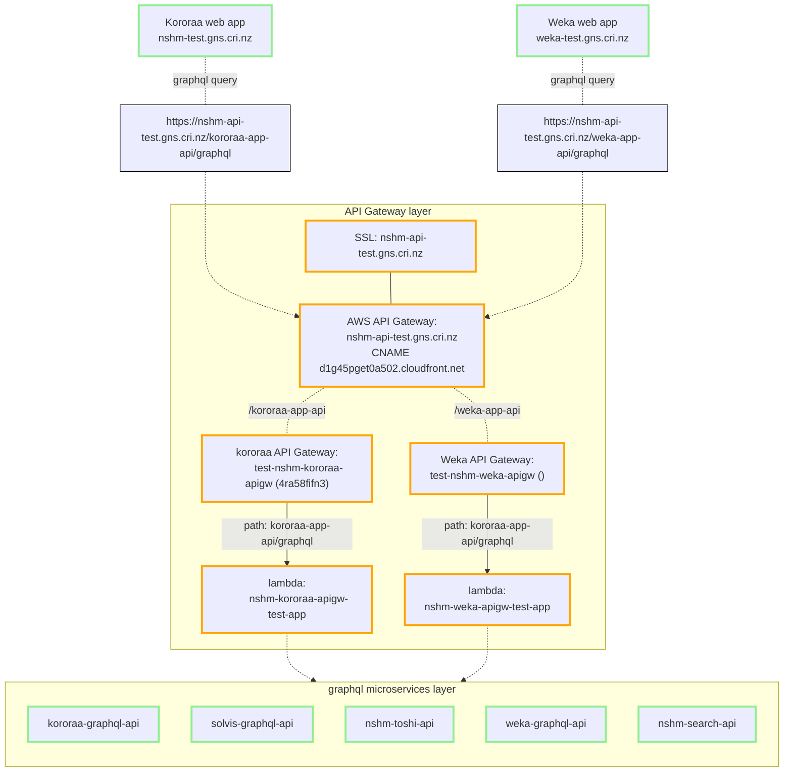

## TEST environment

```mermaid
graph TD
    classDef nshm stroke:lightgreen, stroke-width:3px
    classDef AWS stroke:orange, stroke-width:3px
    classDef SVC stroke:powderblue, stroke-width:3px
    classDef note stroke:black, stroke-width:1px
    
    K["Kororaa web app
    nshm-test.gns.cri.nz"]:::nshm
    NB["https://nshm-api-test.gns.cri.nz/kororaa-app-api/graphql"]:::note 

    W["Weka web app
        weka-test.gns.cri.nz"]:::nshm
    NB3["https://nshm-api-test.gns.cri.nz/weka-app-api/graphql"]:::note 

    subgraph GW["API Gateway layer"]

        SSL["SSL: nshm-api-test.gns.cri.nz"]:::AWS
        
        Z["AWS API Gateway:
        nshm-api-test.gns.cri.nz CNAME d1g45pget0a502.cloudfront.net"]:::AWS

        Z -.-|/kororaa-app-api| A
        Z -.-|/weka-app-api| C

        A["kororaa API Gateway:
        test-nshm-kororaa-apigw (4ra58fifn3)"]:::AWS
        F0["lambda:
        nshm-kororaa-apigw-test-app"]:::AWS

        C["Weka API Gateway:
        test-nshm-weka-apigw ()"]:::AWS
        F2["lambda:
        nshm-weka-apigw-test-app"]:::AWS

        A -->|path: kororaa-app-api/graphql| F0 
        C -->|path: kororaa-app-api/graphql| F2

    end
    K -.-|graphql query| NB -..-> Z
    SSL --- Z 
    W -.-|graphql query| NB3 -..-> Z

    subgraph SUP["graphql microservices layer"]
        direction TB

        K-API[kororaa-graphql-api]:::nshm
        S-API[solvis-graphql-api]:::nshm
        T-API[nshm-toshi-api]:::nshm
        W-API[weka-graphql-api]:::nshm
        Q-API[nshm-search-api]:::nshm
                            
    end

    F0 -.-> SUP
    F2 -.-> SUP

```