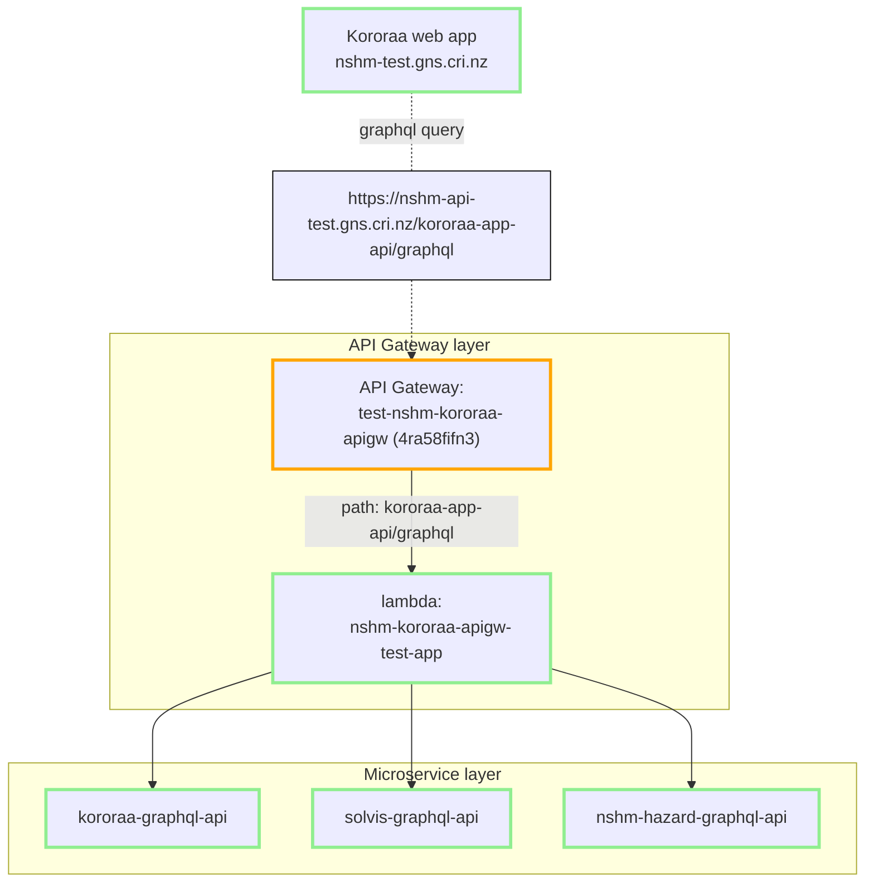

## The Graphql Application API gateway pattern
There are two API layers involved for the main NSHM web applications (Kororaa and Weka). The pattern is commonly known as  a `microservice` architecture, where the lower layer consists of domain-specific services that are then composed into collections by an API gateway.  Try google [or here](https://microservices.io/index.html) for information about this style of services organisation.

The NSHM service APIs are [graphql standard](https://graphql.org/) apis. This means that the API gateway can provide [schema stitching](https://the-guild.dev/graphql/stitching/docs) to improve flexibilty and efficiencies that benefit the client application.

### Kororaa TEST as an example

The Kororaa application communicates with a single API gateway, which passes on calls to the relevant API microservice(s):

Kororaa connects to API Gateway at **nshm-api-test.gns.cri.nz/kororaa-app-api**. The gateway path maps to the associated lambda function i.e **nshm-kororaa-apigw-test-app**. in turn, this lambda function runs a lightweight node express service that stitches and proxies to the required microservices.

For Kororaa the microservices are:

 - [kororaa-graphql-api](/nzshm-documentation/components/kororaa_graphql_api) which handles Kororaa app specific functions e.g help text, science publications, model release history. 

 - [solvis-graphql-api](/nzshm-documentation/components/solvis_graphql_api) supports the rupture explorer map, and is based the solvis library. 

 - [nshm-hazard-graphql-api](/nzshm-documentation/components/nshm_toshi_api) supports the hazard curve and hazard map user queries. 

 For more specific configurations please see **[API gateway deployments](../api_gateway_deployments)**.
