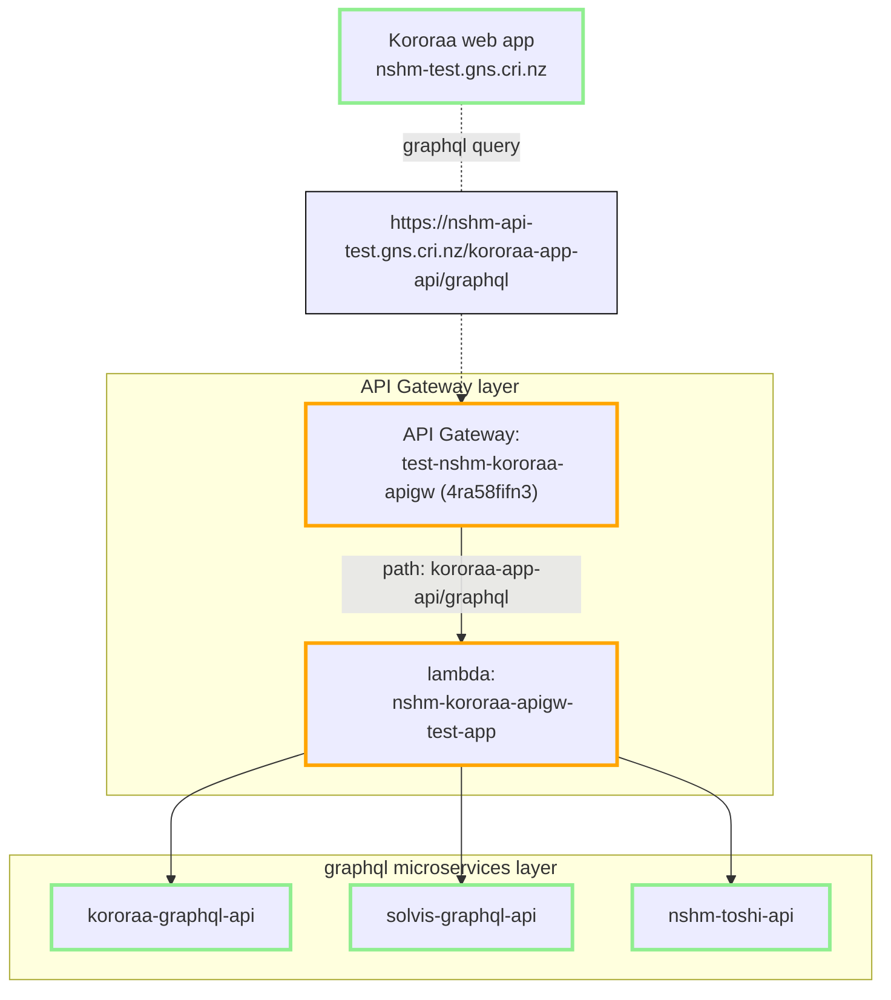
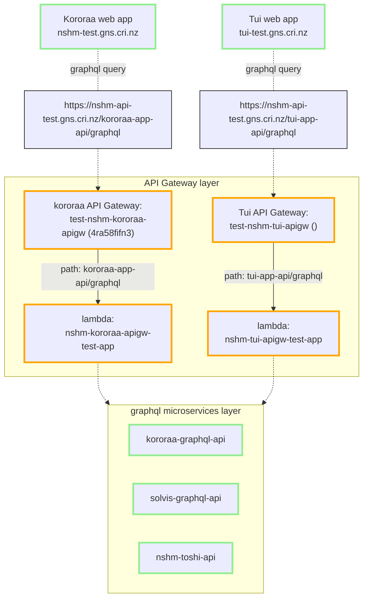

## The Graphql Application API gateway pattern
There are two API layers involved for the main NSHM web application (Kororaa) . The pattern is commonly known as  a `microservice` architecture, where the lower layer consists of domain-specific services that are then composed into collections by an API gateway. THe Kororaa application is required to communicate with a single API gateway, which in turn passes on call to the relevant API microservice(s). Try google [or here](https://microservices.io/index.html) for information about this style of services organisation.

The NSHM service APIs are all using [graphql standard](https://graphql.org/). This means that the API gateway can also provide [schema stitching](https://the-guild.dev/graphql/stitching/docs) to improve flexibilty and efficiencies that benefit the client application.

In the Kororaa APP API Gateway example shown above we have a web application client which communicates with a single API Gateway endpoint. This APIGW in turn communicates with whichever domain API services are required to service the application functions.

 - [Kororaa application API Gateway](/nzshm-documentation/components/nshm_kororaa_apigw/)

 - [solvis-graphql-api](/nzshm-documentation/components/solvis_graphql_api)

## Combined model

