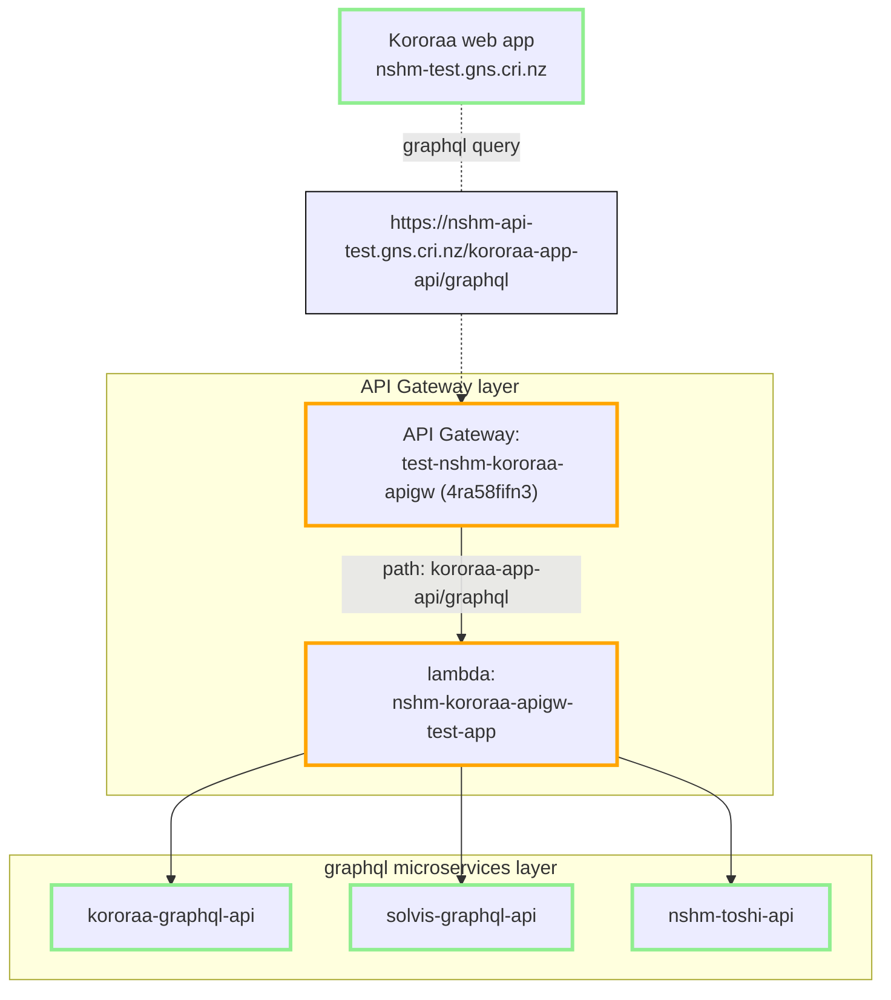

## The Graphql Application API gateway pattern
There are two API layers involved for the main NSHM web application (Kororaa) . The pattern is commonly known as  a `microservice` architecture, where the lower layer consists of domain-specific services that are then composed into collections by an API gateway. THe Kororaa application is required to communicate with a single API gateway, which in turn passes on call to the relevant API microservice(s). Try google [or here](https://microservices.io/index.html) for information about this style of services organisation.

The NSHM service APIs are all using [graphql standard](https://graphql.org/). This means that the API gateway can also provide [schema stitching](https://the-guild.dev/graphql/stitching/docs) to improve flexibilty and efficiencies that benefit the client application.

In the Kororaa APP API Gateway example shown above we have a web application client which communicates with a single API Gateway endpoint via the DNS hostname/path **nshm-test.gns.cri.nz/kororaa-app-api**. This API gateway simply directs request bys their path to the associated lambda function i.e **nshm-kororaa-apigw-test-app**. This lambda function runs a lightweight node express application that stitches and proxies to the required  microservices.

Also shown as examples in the diagram above we have:

 - [Kororaa application API Gateway](/nzshm-documentation/components/nshm_kororaa_apigw/) which is the stitching app gateway for Koroaa.

 - [kororaa-graphql-api](/nzshm-documentation/components/kororaa_graphql_api) is an API microservice that deals with kororaa app specific functions e.g help text, science publications, model release history. 

 - [solvis-graphql-api](/nzshm-documentation/components/solvis_graphql_api) is an API microservice that deals with solvis functions. 

 - [nshm-toshi-api](/nzshm-documentation/components/nshm_toshi_api) is an API microservice for tracking experimental processes and artefacts (inputs and outputs). 

 For more specific configurations please see **[API gateway deployments](./api_gateway_deployments)**.
