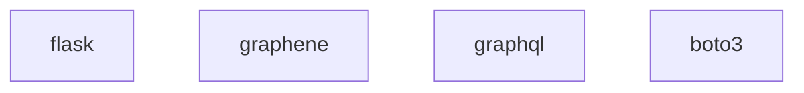

## Common Infrastructure

NSHM web services use these following core libraries and cloud services across the services layer.

## Cloud services

## Python libraries for APIs

## Python libraries for Science

These are the main python libraries used commonly throughtout science application code.

## Javascript libraries for APIs
