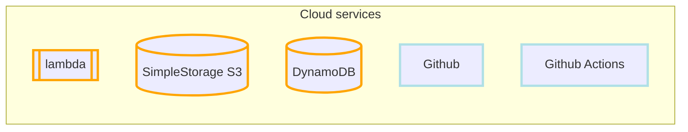
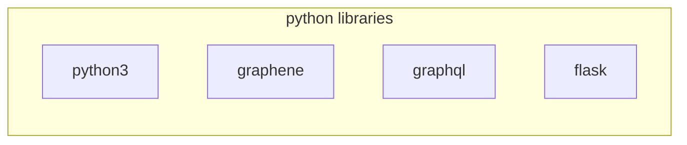

## Common Infrastructure

NSHM web services use these following core libraries and cloud services across the services layer.

## CLoud services

```mermaid
graph LR
    classDef nshm stroke:lightgreen, stroke-width:3px
    classDef AWS stroke:orange, stroke-width:3px
    classDef SVC stroke:powderblue, stroke-width:3px    
    subgraph C[Cloud services]
        l[[lambda]]:::AWS
        S3[( SimpleStorage S3 )]:::AWS
        D[(DynamoDB)]:::AWS
        %%ES[[ElasticSearch]]:::AWS
        GH[Github]:::SVC
        GHA[Github Actions]:::SVC
    end
```

## Common Python libraries

```mermaid
graph LR
    subgraph P[python libraries]
        python3
        graphene
        graphql
        flask
    end
```
