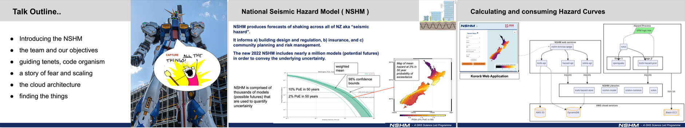

# NSHM System Architecture

Describing the primary tools and services supporting the NSHM and how we use them.

## Table of contents

This section will cover: 

 - API webservices
 - NSHM libraries
 - Cloud Services
 - Data Management
 - Compute Abstraction
 - USGS:Opensha
 - GEM:Openquake  

## NSHM system guiding tenets

 - Make our work public at  https://github.com/GNS-Science.
 - capture all the things(TM) and make them accessible.
 - minimise fixed overhead, using cloud & serverless technology.
 - keep options open for compute intensive tasks (local, HPC, cloud).

## Background reading

The team has produced some papers and presentations about this work, covering, high level goals, teeam setup, technical challenges and architecture. Rather than repeat all that we're including the PDF document you can peruse. 

Here's a brief summary of some of these:

### NZ eResearch Presentation, January 2024
    

The Chris's (DiCaprio and Chamberlain) presented an overview of the teams work for the NSHM. This covers the teams purpose, the technical vision
and then describes the particular technical challenges and key technology choices made to meet these. It features a great deal of the software and solutions in this documentation.

[eRangahau/eResearch 2024 slides in PDF format](./assets/eResearch 2024 Presentation.pdf) 

### NSHM Workshop 21 05 2024 - Toshi Hazard Post etc

**Re-engineering the Hazard Calculation: toshi-hazard-post & toshi-hazard-store v2.**

The Chris's (DiCaprio and Chamberlain) presented on how Hazard processing and Hazard storage has evolved and changed. An introduction to the new Pyarrow dataset format with pros/cons vs earlier data formats.

[NSHM Workshop 21_05_2024 slides in PDF format](./assets/NSHM Workshop 21_05_2024 - THP v2.pdf)

