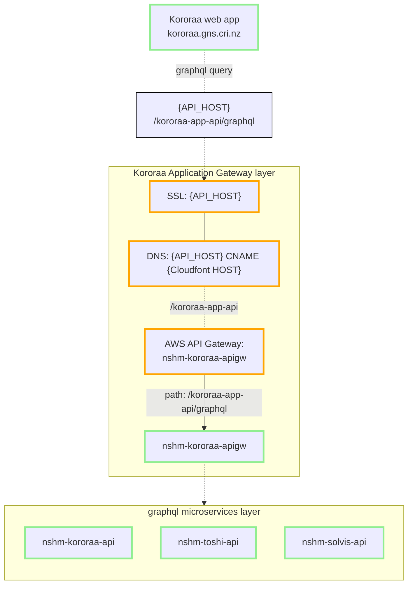

## Kororaa web application stack

The **Kororaa App** is the public web site for NSHM scientific results. 

## Custom components

These components are developed and supported by the Compute Working Group team.

 - [Kororaa wep application ](/nzshm-documentation/components/kororaa/) is the Kororaa UI.
    
    **Github:** [GNS-Science/kororaa](https://github.com/GNS-Science/kororaa).

 - [Kororaa API Gateway](/nzshm-documentation/components/nshm_kororaa_apigw/) is the application API for Kororaa.
    
    **Github:** [GNS-Science/nshm-kororaa-apigw](https://github.com/GNS-Science/nshm-kororaa-apigw).

 - [solvis-graphql-api](/nzshm-documentation/components/solvis_graphql_api) is a graphql API wrapping the [solvis](https://github.com/GNS-Science/solvis) library. 
    
    **Github:** [GNS-Science/solvis-graphql-api](https://github.com/GNS-Science/solvis-graphql-api). Used by the Rupture Map explorer UI component.

 - [nshm-toshi-api](/nzshm-documentation/components/nshm_toshi_api) is a graphql API managing the NSHM experimental artefacts.
    
    **Github:** [GNS-Science/nshm-toshi-api](https://github.com/GNS-Science/nshm-toshi-api).

The AWS stacks (AWS API Gateway and below) are managed via the serverless configurations of each service. 
Usually there is a PROD and TEST stage deployment, and sometimes a DEV deployment too.

## Cloud configuration

These components are configured so that the stack functions correctly. As they're rarely touched they are maintained manually,
 via the AWS Console unless stated otherwise.

 - Elastic Search API is an AWS Kibana/Elastic managed service. Objects stored in ToshiAPI are indexed here, and used via the Kororaa Search UI.

 - SSL certificates are issued via AWS Certificate Manager (ACM) for the Domain hosts used by NSHM (see us-east-1 region).

 - AWS Cloudfront provides a global content delivery service and maps SSL domain host onto the internal services names via cloudfront host names.

 - GNS Internal IT manage the DNS zone entriesfor NSHM SSL certificates, hostnames, and verifcations.

 - Google Analytics (not configured)

Lower levels of the AWS stack (AWS API Gateway and below) are generally managed via the serverless configurations of each service.

## Stack diagram

