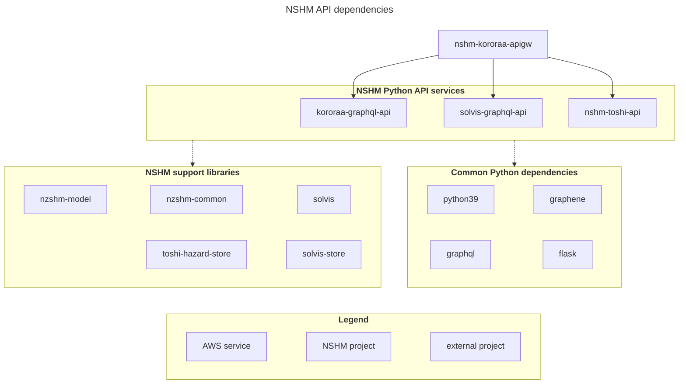

## NSHM web service API overview

Web service API for the NSHM are [graphql](https://graphql.org/) APIs, providing flexibility and control for the consumer over what information the API returns. Graphql APIs include a type system, built in documentation and standard error handling.

NSHM APIs and supporting packages are divided into domains or functional areas, each with a public github project source repository. These are:
 
## API Services

 - **[nshm-kororaa-apigw](https://github.com/GNS-Science/nshm-kororaa-api)** amalgamates the function-specific apis into an application API Gateway for the NSHM web app (aka Kororaa).

 - **[nshm-toshi-api](https://github.com/GNS-Science/nshm-toshi-api)** provides the catalogue of all NHSM experiments including control metadata and all the input and output artefacts. Objects are uniquely identified and accessible across the higher-order services.

 - **[kororaa-graphql-api](https://github.com/GNS-Science/kororaa-graphql-api)** provides applicatoin specific information to the NSHM (kororaa) web application e.g. help, tooltips, document links.
 
 - **[solvis-graphql-api](https://github.com/GNS-Science/solvis-graphql-api)** provides analytical services to help explore and analyse key components of the NSHM source rate model.

## NSHM support libraries
 
  - **[toshi-hazard-store](https://github.com/GNS-Science/toshi-hazard-store)** stores the hazard results of the formally published NSHM model for gridded (10km), and the towns and cities of NZ.

  - **[solvis-store](https://github.com/GNS-Science/solvis-store)** provides a cloud caching service to speed up compute-expensive solvis operations for use in the webservices API.

  - **[solvis](https://github.com/GNS-Science/solvis)** is a library to work with opensha solution files and aggregations aka NSHM composite solutions.

- **[nzshm-model](https://github.com/GNS-Science/nzshm-model)** defines the logic tree of NSHM model versions.

- **[nzshm-common](https://github.com/GNS-Science/nzshm-common-py/)** contains core information and functions used across other NSHM components. e.g. standard location definitions, grid resolution functions.

## Dependencies diagram
 

## More information

The NSHM Computational Working Group (CWG) documentation project covers:
 - **NSHM CWG Scientific Processes** describes the processes and tools used to run experiments and build the NSHM models.

 - **NSHM CWG [Systems Architecture](https://github.com/GNS-Science/nzshm-documentation/architecture/)** covers the overarching design of the tools, services used run, publish and support the NSHM.

 - **NSHM CWG Technical Guidelines** describes standards and common technical processes used to maintain and operate the NSHM systems. 

 - **NSHM CWG Github Index** is a list of all the NSHM github project repositorys
 
Each NSHM github project repository should contain a `/docs` folder containing project-pecific information. Often these docs will be published as GH-pages e.g. for **toshi-hazard-store** :

 - project repository -> https://github.com/GNS-Science/toshi-hazard-store

 - project docs -> https://gns-science.github.io/toshi-hazard-store/