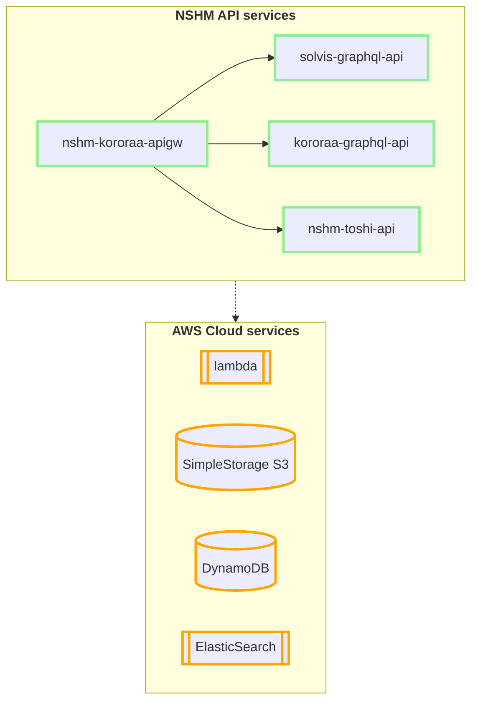

## NSHM web services

Web service API for the NSHM are [graphql](https://graphql.org/) APIs, providing control for the consumer over what the API returns. Graphql APIs include a type system, built in documentation and standard error handling.

```mermaid
graph TD
    classDef nshm stroke:lightgreen, stroke-width:3px
    classDef AWS stroke:orange, stroke-width:3px
    classDef SVC stroke:powderblue, stroke-width:3px    


    subgraph API[<strong>NSHM API services</strong>]
        N-APIGW[nshm-kororaa-apigw]:::nshm
        K-API[kororaa-graphql-api]:::nshm
        S-API[solvis-graphql-api]:::nshm
        T-API[nshm-toshi-api]:::nshm    
    end

    
    subgraph CLOUD[<strong>AWS Cloud services</strong>]
        l[[lambda]]:::AWS
        S3[( SimpleStorage S3 )]:::AWS
        D[(DynamoDB)]:::AWS
        ES[[ElasticSearch]]:::AWS
    end

    API -.-> CLOUD
    N-APIGW --> S-API
    N-APIGW --> K-API
    N-APIGW --> T-API    
```

NSHM APIs and supporting packages are divided into domains or functional areas, each with a public github project source repository. These are:
 
## API Services

 - **[nshm-kororaa-apigw](/nzshm-documentation/components/nshm_kororaa_apigw/)** amalgamates the function-specific apis into an application API Gateway for the NSHM web app (aka Kororaa).

 - **[nshm-toshi-api](https://github.com/GNS-Science/nshm-toshi-api)** provides the catalogue of all NHSM experiments including control metadata and all the input and output artefacts. Objects are uniquely identified and accessible across the higher-order services.

 - **[kororaa-graphql-api](https://github.com/GNS-Science/kororaa-graphql-api)** provides application specific information to the NSHM (kororaa) web application e.g. help, tooltips, document links.
 
 - **[solvis-graphql-api](/nzshm-documentation/components/solvis_graphql_api/)** provides analytical services to help explore and analyse key components of the NSHM source rate model.

 For more general information please look at the **[API gateway pattern](./api_gateway_pattern)** and **[API gateway deployments](./api_gateway_deployments)** pages.

## NSHM support libraries
 
  - **[toshi-hazard-store](https://github.com/GNS-Science/toshi-hazard-store)** stores the hazard results of the formally published NSHM model for gridded (10km), and the towns and cities of NZ.

  - **[solvis-store](https://github.com/GNS-Science/solvis-store)** provides a cloud caching service to speed up compute-expensive solvis operations for use in the webservices API.

  - **[solvis](https://github.com/GNS-Science/solvis)** is a library to work with opensha solution files and aggregations aka NSHM composite solutions.

- **[nzshm-model](https://github.com/GNS-Science/nzshm-model)** defines the logic tree of NSHM model versions.

- **[nzshm-common](https://github.com/GNS-Science/nzshm-common-py/)** contains core information and functions used across other NSHM components. e.g. standard location definitions, grid resolution functions.

### NSHM sub-projects

Each NSHM github project repository should contain a `/docs` folder containing project-pecific information. Often these docs will be published as GH-pages e.g. for **toshi-hazard-store** :

 - project repository -> https://github.com/GNS-Science/toshi-hazard-store

 - project docs -> https://gns-science.github.io/toshi-hazard-store/
