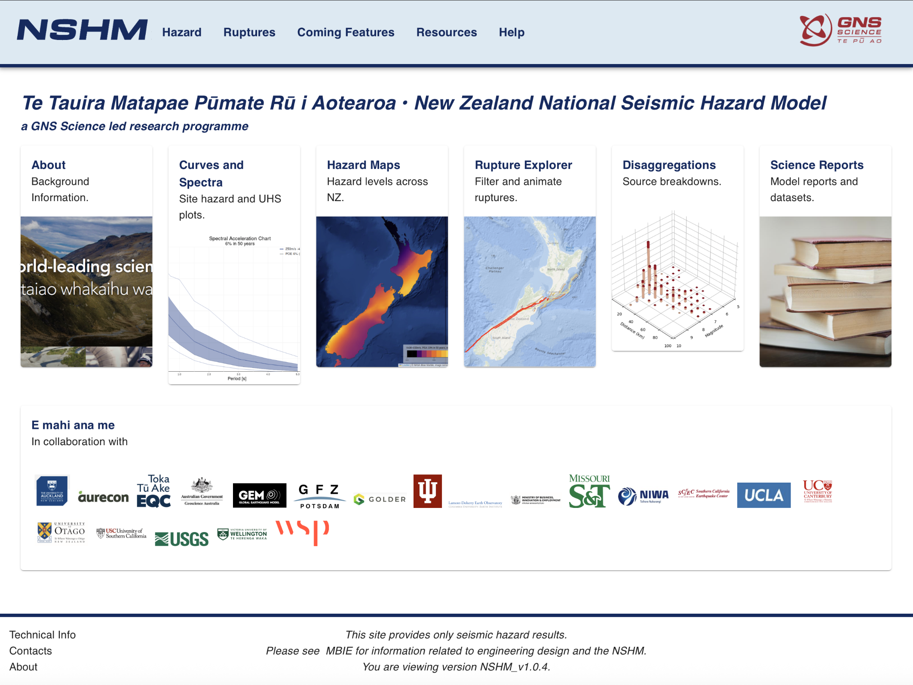

# Kororaa web application

A React web application

The **Kororaa App** is the public website for NSHM scientific results, it's available at https://nshm.gns.cri.nz 
It's used by Geoseimic scientists, Researchers, Engineering and Insurance experts to help understand the 
properties of the 2022 National Seismic Hazard Model of NZ.


 - [Kororaa Deployment Stack](/nzshm-documentation/architecture/kororaa_deployment_stack/) describes the complete stack.
 - [Api Gateway Pattern](/nzshm-documentation/architecture/api_gateway_pattern/) describes the pattern used by the Weka and Kororaa stacks.
 - **Github:** [GNS-Science/kororaa](https://github.com/GNS-Science/kororaa)



### Architecture

Below is a simplified diagram, please see [Kororaa Deployment Stack](/nzshm-documentation/architecture/kororaa_deployment_stack/) for more detail.


**Kororaa** uses the **Kororaa Applicaton API gateway** which consolidates several APIs, each providing specific features.


### Deployments

### Environment settings

There are many for Kororaa, best consult the Github repo `.env.example` file

```
VITE_DISCLAIMER_VERSION=MadMess-V3
VITE_GRAPHQL_ENDPOINT=..../graphql
VITE_GRAPHQL_API_KEY=$##@!
VITE_RESOLUTION=0.2
VITE_GRID_ID=NZ_0_2_NB_1_1
VITE_HAZARD_MODEL=SLT_v7_gmm_v1


VITE_MAP_IMTS=PGA,SA(0.1),SA(0.5),SA(1.0)
VITE_MAP_VS30S=250,300,350,400,450,750
VITE_MAP_STATISTICS=mean
VITE_MAP_POES=0.1, 0.02
VITE_MAP_COLOR_SCALE=jet,inferno
VITE_MAP_ZOOM_MIN=4
VITE_MAP_ZOOM_MAX=8
VITE_MAP_ZOOM_SNAP=0.5
VITE_MAP_ZOOM_DELTA=0.5
VITE_MAP_STROKE_WIDTH=0.1
VITE_MAP_VMAX=auto

#Hazard chart
VITE_HAZARD_GMAX=10
VITE_HAZARD_GMIN=0.01
VITE_HAZARD_GMAX_LOG=10
VITE_HAZARD_GMIN_LOG=0.01
VITE_HAZARD_POEMAX=6
VITE_HAZARD_POEMIN=0.000001
VITE_HAZARD_COLOR_MAP=jet
VITE_HAZARD_COLOR_LIMIT=10
VITE_HAZARD_COLOR_UNCERTAINTY_OPACITY=0.5

#Spectral chart
VITE_SA_PERIODMAX=10
VITE_SA_PERIODMIN=0.1
VITE_SA_PERIODMAX_LOG=10
VITE_SA_PERIODMIN_LOG=0.1
VITE_SA_GMAX=auto
VITE_SA_GMIN=0.1
VITE_SA_LOG_PGA_SUBSTITUTE=0.001

#Hazard & Spectral chart disagg config
VITE_MEAN=mean
VITE_UPPER1=0.9
VITE_UPPER2=0.95
VITE_LOWER1=0.1
VITE_LOWER2=0.05

//Only set this to test when running cypress locally, activates mock service worker. If you want API to run leave it unset.
VITE_MSW=test

#package html-to-image has a bug with source map generation, disabling allows CI to run
GENERATE_SOURCEMAP=false

VITE_GA_ID=G-XXXXXXXX
VITE_GA_DEBUG_MODE=false

VITE_SOLVIS_ENDPOINT=https://api.com/
VITE_SOLVIS_API_KEY=#@$%^
VITE_ANALYSIS_LOC_LIST_ID=NZ
VITE_RADII_ID=6

VITE_IFM_FAULT_COLOUR=red
VITE_IFM_LOCATION_COLOUR=grey
```


