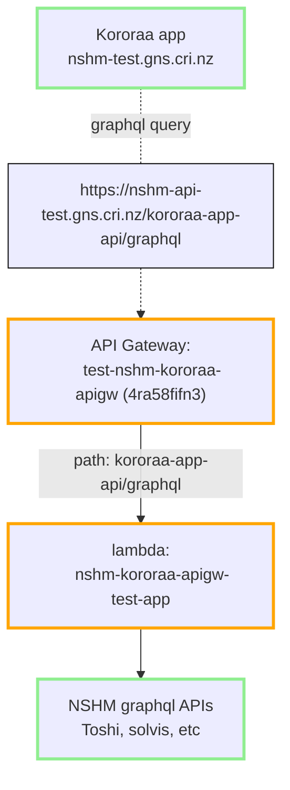

## AWS API deployment info

This document describes the NSHM API component layers and their configuration on AWS.

### Deployment environments

### Manual (one-time) configuration 

### Automated deployments

_notes on process for PROD Kororaa deployment which may move into the relevant sub project_

### TEST environment on AWS

The following is setup in [GH nshm-kororaa-api ](https://github.com/GNS-Science/nshm-kororaa-api)


### Deployment 

Automated via Github actions deploy.yml

```
# serverless.yml
service: nshm-kororaa-apigw
```

### DNS using API Gateway > Custom domain names

Map paths from your domain name to your API stages

for domain name: `nshm-api-test.gns.cri.nz`:


| API                     | Stage | Path             | Default endpoint |
| ----------------------- | ----- | ---------------- | ---------------- |
| test-nshm-kororaa-apigw | test  | kororaa-app-api  | Enabled          |
| test-nzshm22-nshm-api   | test  | nshm             | Enabled          |


### API endpoint resolution

From the Kororaa web app client to the AWS hosted API. 



## Main components

 - [Kororaa application API Gateway](/nzshm-documentation/components/nshm_kororaa_apigw/)

 - [solvis-graphql-api](/nzshm-documentation/components/solvis_graphql_api)