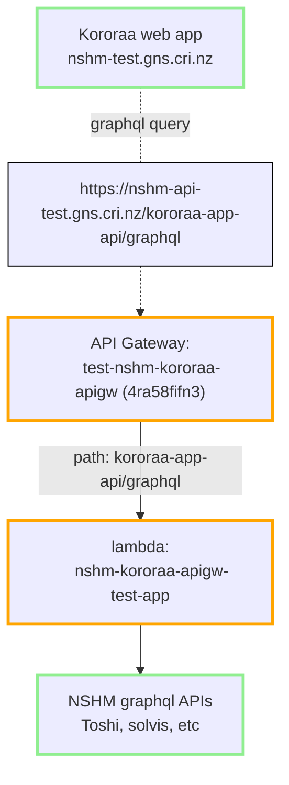

## The Graphql Application API gateway pattern

From the Kororaa web app client to the AWS hosted API. 



There are two API layers involved for the main NSHM web applicatoin (Kororaa) . The pattern is commonly known as  a `microservice` architecture, where the lower layer consists of domain-specific services that are then composed into collections by an API gateway. THe Kororaa application is required to communicate with a single API gateway, which in turn passes on call to the relevant API microservice(s). Try google [or here](https://microservices.io/index.html) for information about this style of services organisation.

The NSHM service APIs are all using [graphql standard](https://graphql.org/). This means that the API gateway can also provide [schema stitching](https://the-guild.dev/graphql/stitching/docs) to improve flexibilty and efficiencies that benefit the client application.


 - [Kororaa application API Gateway](/nzshm-documentation/components/nshm_kororaa_apigw/)

 - [solvis-graphql-api](/nzshm-documentation/components/solvis_graphql_api)

### API endpoint resolution


### TEST environment on AWS

_notes on process for PROD Kororaa deployment which may move into the relevant sub project_

The following is setup in [GH nshm-kororaa-api ](https://github.com/GNS-Science/nshm-kororaa-api)


### Deployment 

Automated via Github actions deploy.yml

```
# serverless.yml
service: nshm-kororaa-apigw
```

### DNS using API Gateway > Custom domain names

Map paths from your domain name to your API stages

for domain name: `nshm-api-test.gns.cri.nz`:


| API                     | Stage | Path             | Default endpoint |
| ----------------------- | ----- | ---------------- | ---------------- |
| test-nshm-kororaa-apigw | test  | kororaa-app-api  | Enabled          |
| test-nzshm22-nshm-api   | test  | nshm             | Enabled          |

