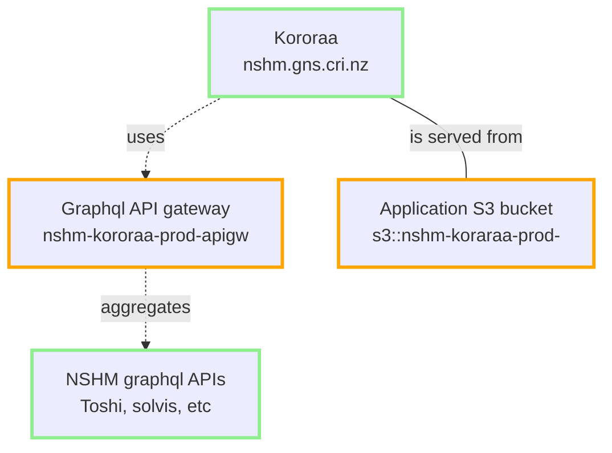

# Introducing Kororaa and its Application API gateway

Th NSHM public web application (aka **Kororaa**) has an **Applicaton API gateway** which consolidates NSHMs functional APIs using graphql stitching.

