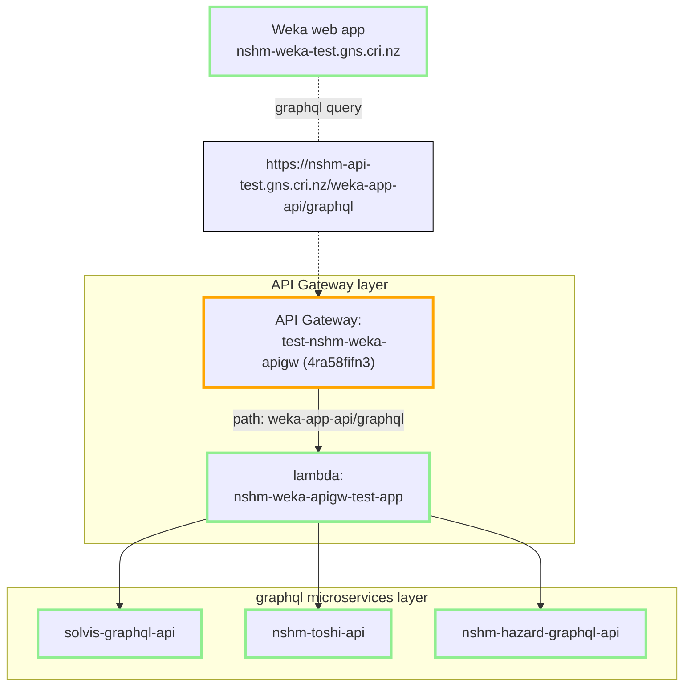

# Weka Application API Gateway

A stitched graphql API for the NSHM Weka web app (aka Weka).

- on **Github:** [GNS-Science/nshm-weka-apigw](https://github.com/GNS-Science/nshm-weka-apigw)

For an overview, please see the [Api Gateway Pattern](/nzshm-documentation/architecture/api_gateway_pattern/) page.




## Deployments

Deployment environments AWS_TEST and AWS_PROD each define the following variables:

```
NZSHM22_HAZARD_API_KEY
NZSHM22_HAZARD_API_URL
NZSHM22_SOLVIS_API_KEY
NZSHM22_SOLVIS_API_URL
NZSHM22_TOSHI_API_KEY
NZSHM22_TOSHI_API_URL
```

-----
### TEST
-----

#### API gateway configuration
| AWS  (API gateway)                     | Github Environment | Branch       |
| -------------------------------------- | ------------------ | ------------ | 
| test-nshm-weka-apigw (3ksmpv8l4i)   |          | deploy-test  | 

#### Lambda
| AWS lambda function name                                    | Github Environment | Branch       |
| ----------------------------------------------------------- | ------------------ | ------------ | 
| nshm-weka-apigw-test-app                                    | AWS_TEST           | deploy-test  | 
| nshm-weka-apigw-test-warmup-plugin-littleWarmer             | AWS_TEST           | deploy-test  | 

#### Serverless log from GHA deploy script
```
Deploying nshm-weka-apigw to stage test (ap-southeast-2)
WarmUp: Creating warmer "littleWarmer" to warm up 1 function

✔ Service deployed to stack nshm-weka-apigw-test (66s)

api keys:
  WEKA_APIGW_TempApiKey-test: gXj***SP - Api key until we have an auth function
endpoints:
  OPTIONS - https://3ksmpv8l4i.execute-api.ap-southeast-2.amazonaws.com/test/{any+}
  POST - https://3ksmpv8l4i.execute-api.ap-southeast-2.amazonaws.com/test/{any+}
  GET - https://3ksmpv8l4i.execute-api.ap-southeast-2.amazonaws.com/test/{any+}
functions:
  app: nshm-weka-apigw-test-app (11 MB)
  warmUpPluginLittleWarmer: nshm-weka-apigw-test-warmup-plugin-littleWarmer (1.2 kB)
Serverless Domain Manager:
  Domain Name: nshm-api-test.gns.cri.nz
  Target Domain: d1g45pget0a502.cloudfront.net
  Hosted Zone Id: Z2FDTNDATAQYW2
```

-----
### PROD
-----

#### API gateway configuration
| AWS  (API gateway)                     | Github Environment | Branch       |
| -------------------------------------- | ------------------ | ------------ | 
| prod-nshm-weka-apigw (NONE)      |                    | main  | 

#### Lambda
| AWS lambda function name                                    | Github Environment | Branch       |
| ----------------------------------------------------------- | ------------------ | ------------ | 
| nshm-weka-apigw-prod-app                                    | AWS_PROD           | main         | 
| nshm-weka-apigw-prod-warmup-plugin-littleWarmer             | AWS_PROD           | main         | 


#### Serverless log from GHA deploy script
```
Not deployed
```
