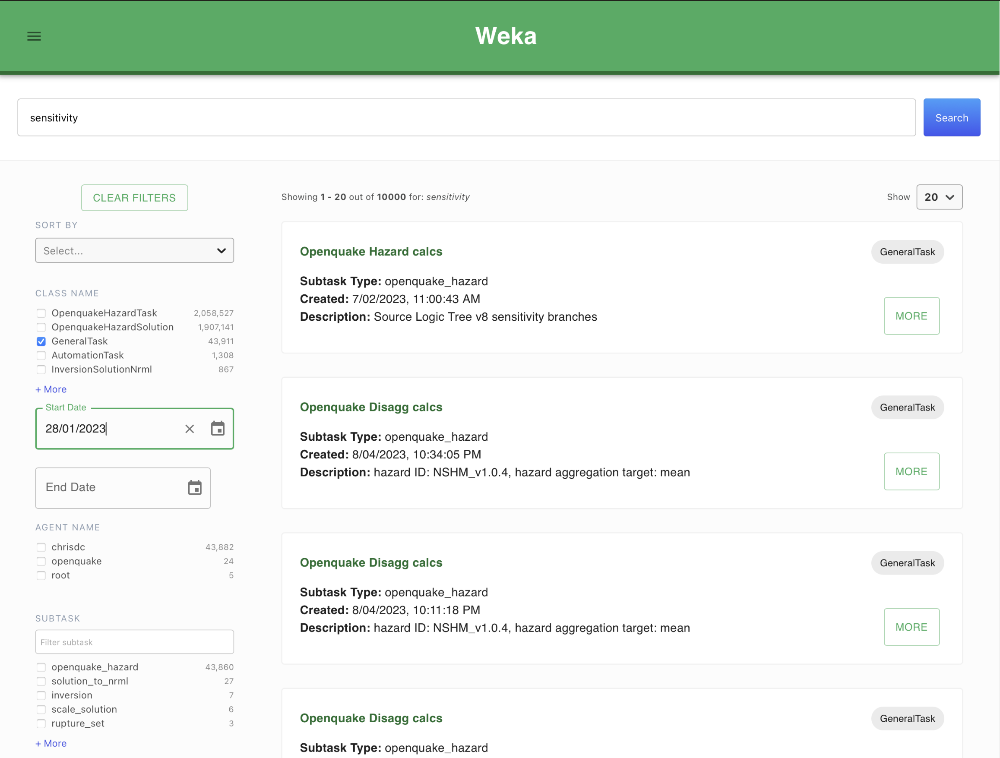

# Weka web application

A React web application for NSHM CWG and scientists at https://weka.gns.cri.nz

**Weka** is used primarily by the CWG team and NSHM scientists 
involved in running and evaluating experimental results from the NSHM CWG [Scientific Process](./science_process/). It supercedes the original **TUI (Toshi UI)** application, providing  similar features, with a more maintainable codebase. 

 - [Weka Deployment Stack](/nzshm-documentation/architecture/weka_deployment_stack/) describes the complete stack.
 - [Api Gateway Pattern](/nzshm-documentation/architecture/api_gateway_pattern/) describes the pattern used by the Weka and Weka stacks.
 - **Github:** [GNS-Science/weka](https://github.com/GNS-Science/weka)

### Weka Search UI

