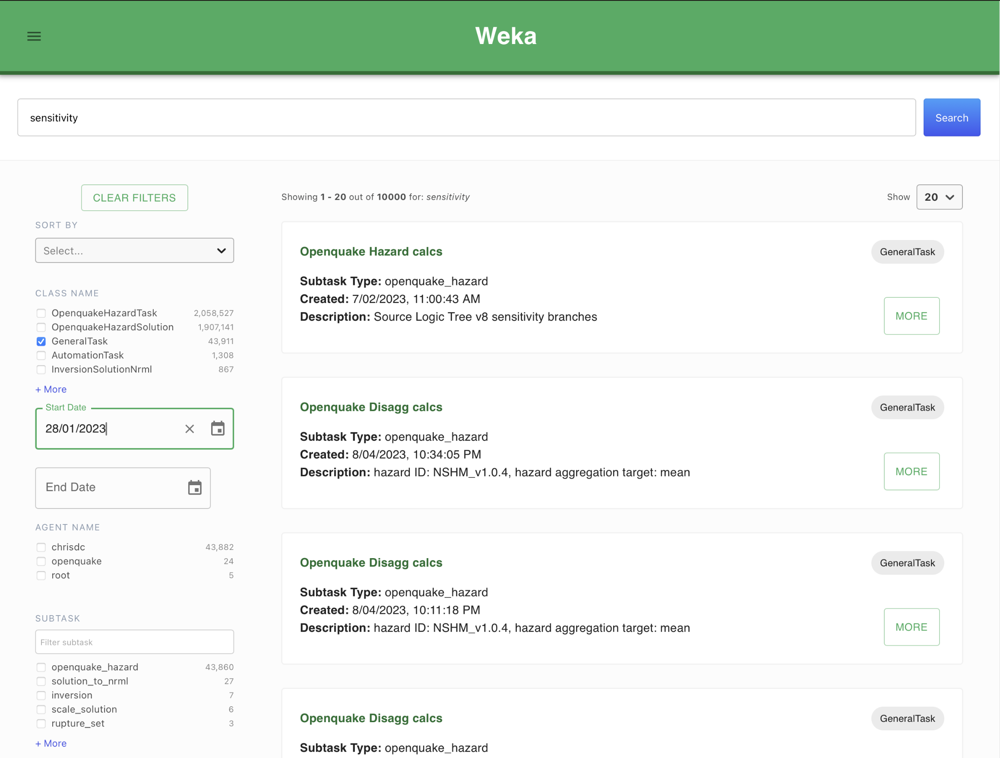

# Weka web application

A React web application for public available at https://nshm.gns.cri.nz

**Weka** supercedes the original **TUI (Toshi UI)** application with similar features, but a modernised architecture. 
It's used primarily by the CWG team and NSHM scientists
involved in running and evaluating experimental results from the NSHM CWG [Scientific Process](./science_process/).


 - [Weka Deployment Stack](/nzshm-documentation/architecture/weka_deployment_stack/) describes the complete stack.
 - [Api Gateway Pattern](/nzshm-documentation/architecture/api_gateway_pattern/) describes the pattern used by the Weka and Weka stacks.
 - **Github:** [GNS-Science/weka](https://github.com/GNS-Science/weka)



### Architecture

Below is a simplified diagram, please see [Weka Deployment Stack](/nzshm-documentation/architecture/weka_deployment_stack/) for more detail.


**Weka** uses the **Weka Applicaton API gateway** which consolidates several APIs, each providing specific features.


### Deployments

### Environment settings

```
VITE_GRAPHQL_ENDPOINT=https://api.net
VITE_GRAPHQL_API_KEY=#######
VITE_HAZARD_MODEL=NSHM_v1.2.3
```


