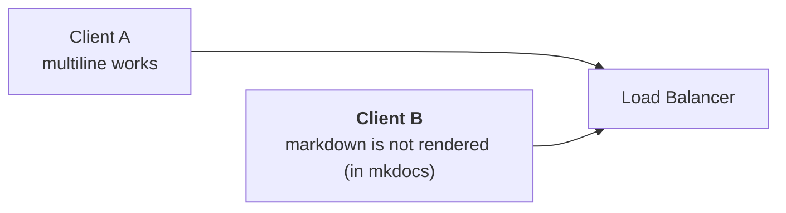
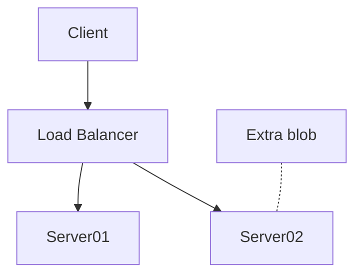
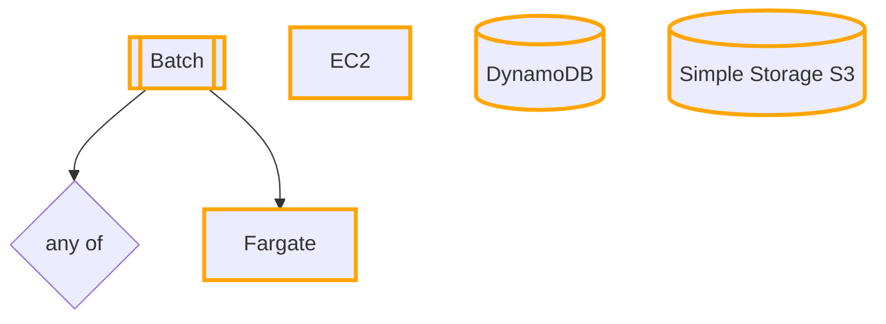
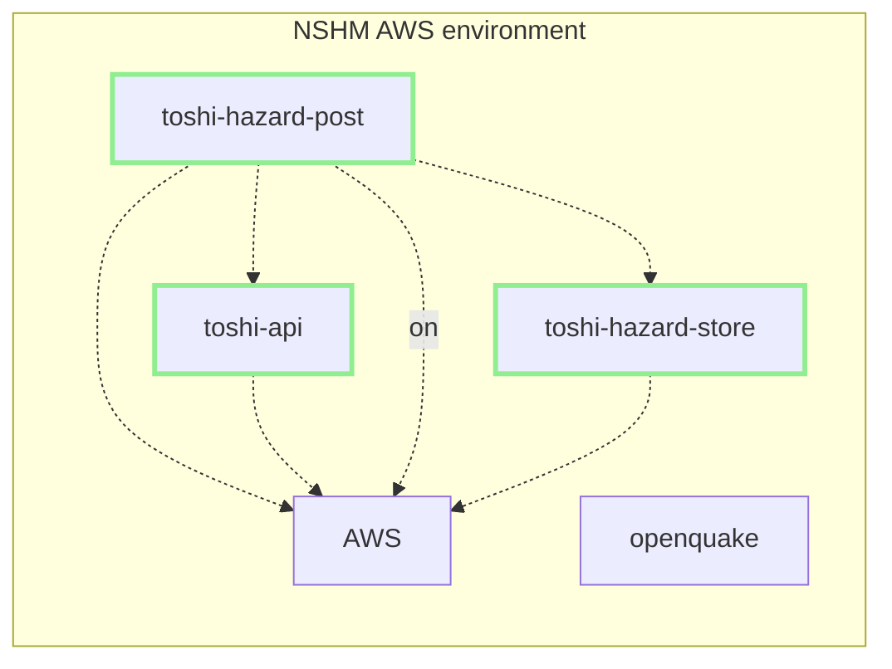

# About mermaid Diagrams

These docs use the mermaid javascript library to render diagrams automatically using a simple syntx (similar to that used plantUML). 

Diagrams can be built easily in a text exidor and many editiros will automatically preview these for you live.

## ALERT: issue with mermaid v10 SYNTAX

FYI there's a open issue https://github.com/squidfunk/mkdocs-material/issues/5758 to be aware of. It's actively being worked on.

Some newer (v10) mermaid syntax features are not yet supported by mkdocs.

The v9.4 syntax for mermaid is applicable now (see https://github.com/mermaid-js/mermaid/blob/release/9.4.3/docs/syntax/flowchart.md).

NB I'm wanting some multi-line text, and markdown formatting but it seems these a v10 only :(

# Test Mermaid

## Snippets

