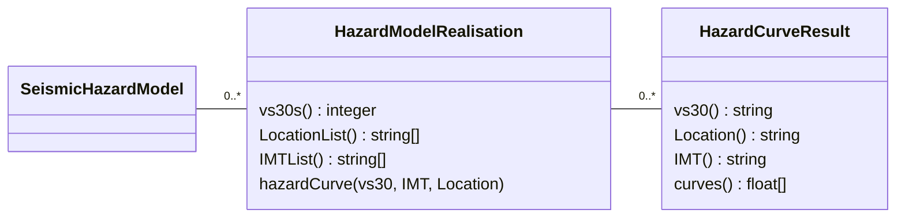

???+ warning "Nov 2023 - this is model under active revision !!"

## Introduction

These are databases of related hazard curves each associated with a specific combination of Sources and GMMs.

## Seismic Hazard Model diagram

???+ "Accessing the NSHM hazard realisations" 

    The NZ NSHM project makes Hazard Model Realisations available via a graphql web API. There is also a python client library that wraps the web API and also allows the user to cache results locally for better performance in many situations.

