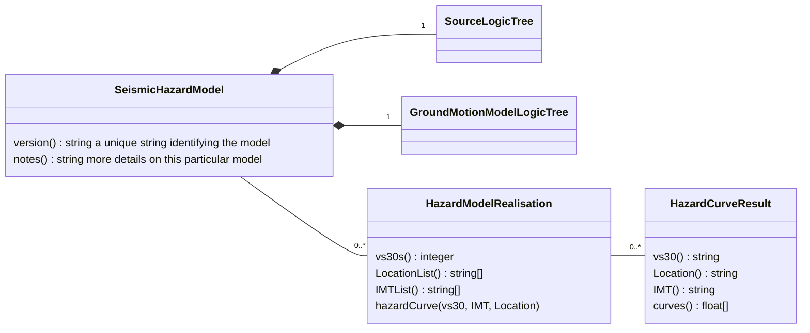
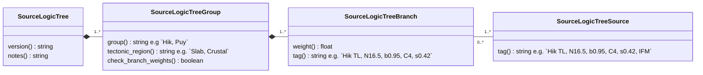
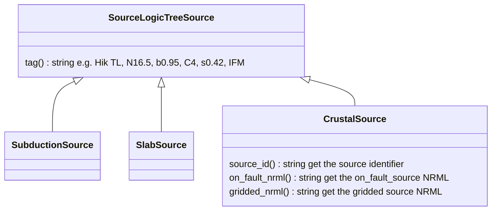

## Introduction 

The NZ NSHM project publishes **Seismic Hazard Model** versions in the [GNS_Science/nzshm-model]() github repository.

Models may be Published or Partial.

 - Published models are for use by 3rd parties e.g. `NSHM_v1.0.4`.
 - Partial/Unpublished models are typically used for comparisons against complete models, e.g sensitivity tests. They usually are most informative when compared to a published model.

## Seismic Hazard Model diagram

## The Source Logic Tree hierarchy

A SourceLogicTree structure describes the 'source' components of the model. Each **SeismicHazardModel** must contain a fully populated **SourceLogicTree**.

A **SourceLogicTree** is further composed of a hierarchy of **SourceLogicTreeGroup**, **SourceLogicTreeBranch** and **SourceLogicTreeSource** objects. 

???+ note "NSHM SourceLogicTreeGroups"

    In `NSHM_v1.0.4` the model contains 4 SourceLogicTreeGroups: one each for Crustal, Hikurangi, Puysegur and Slab sources.

Each SourceLogicTreeSource is a re-useable arrangment of fault sources, so these are uniquely identified to support reuse in independent **Seismic Hazard Models**.

## Types of Source Logic Tree Source.

NSHM and many other SeismicHazardModels will include different types of SourceLogicTreeSource model. 

In NZ NSHM we have three ...

 - Crustal sources usually contain a fault source model NRML and a distributed/gridded source  NRML.
   For NSHM Crustal sources it is helpful to know both the RuptureSet and the inversoin source model as well.
 - Subduction sources contain a single fault source describing the ruptures that can occur across the subduction fault system.
 - A single Slab source that describes source rates occuring in the interface region (25-) 
 
We use the NRML (XML) file format for SourceLogicTreeSource sources. This format is required to run hazard calculation in Openquake, and it's well known throughout our user community.

???+ warning "Nov 2023 - this is model under active revision !!"

