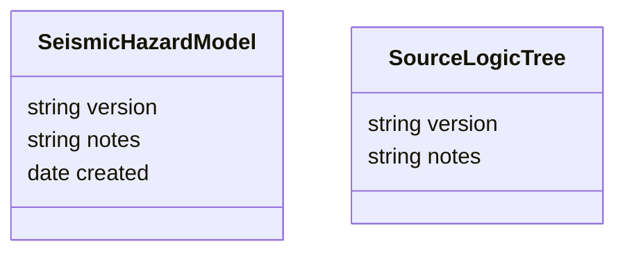

# Seismic Hazard Model



    class SLTG["SourceLogicTreeGroup"] {
        string group e.g `Hik, Puy`
        string tectonic_region e.g. `Slab, Crustal`
    }


```
    class SLTB["SourceLogicTreeBranch"] {
        float weight
        string tag e.g. `Hik TL, N16.5, b0.95, C4, s0.42`
    }

    class SLTF["SourceLogicTreeSource"] {
        string source_id
        string tag e.g. `Hik TL, N16.5, b0.95, C4, s0.42, IFM`
    }

    class GMM_LT["GroundMotionModelLogicTree"] {
        string version
        string notes
    }   

    class GMM_LTB["GroundMotionModelLogicTreeBranch"] {
        float weight
        string args
        string tag e.g. BSSA-2014
    }

    class GMPE["GroundMotionPredictionEquation"] {
        string name e.g. Stirling 2015
        string[] tectonic_regions e.g. [/`Slab, Crustal/`]
        string repository/class
    }
```

```
    Model "0..*" -- "1" SLT
    Model "0..*" -- "1" GMM_LT
    SLT *-- "1..*" SLTG
    SLTG *-- "1..*" SLTB

    SLTB "0..*" -- "1..*" SLTF
    GMM_LT *-- "1..*" GMM_LTB 
    GMM_LTB "0..*" --"1" GMPE
```
