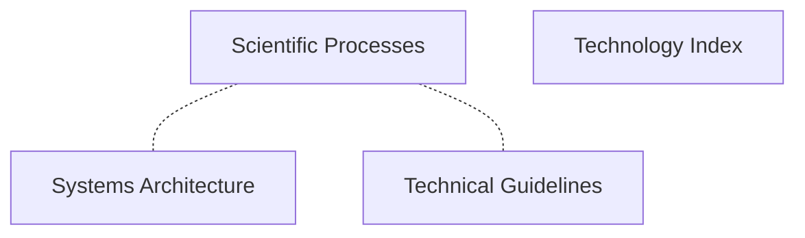
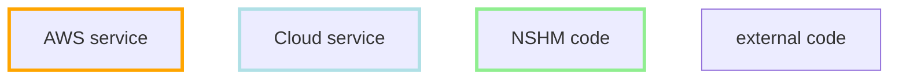
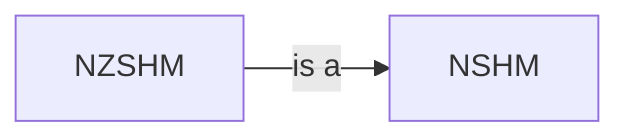
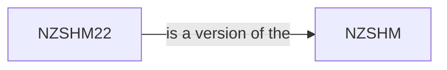

The NSHM Computational Working Group (CWG) documentation project covers:

 - **NSHM CWG [Scientific Process](./science_process/)** describes the processes and tools used to run experiments and build the NSHM models.

 - **NSHM CWG [Systems Architecture](./architecture/)** covers the overarching design of the tools, services used run, publish and support the NSHM.

 - **NSHM CWG Technical Guidelines** describes standards and common technical processes used by the CWG team to maintain and operate the NSHM systems. 

 - **NSHM CWG Index** is a list of all the NSHM project components.

## Project-wide documentation
_where more detail can be found_ 

 - Science publications etc

## Diagram Legend

We use the following convention throughout the diagrams 

## NSHM vs NZSHM

These two acronyms are used quite interchangelbly throughout the project. Either can be found widely e.g. in repository names, Science publications, etc, etc

 - **NSHM** stands for National Seismic Hazard Model
 - **NZSHM** stands for New Zealand Seismic Hazard Model

**NZSHM _is a_ NSHM** . There there are others e.g. the Canadian NSHM, the Japan NSHM). We use NZSHM to specifically identify the **NSHM of Aotearoa New Zealand**. While **NZHSM22** refers to the NZSHM version first published in 2022.

## Documentation maintenance

Please see the [README](./readme.md) file.