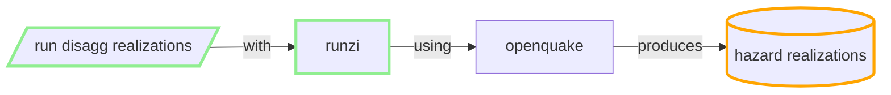
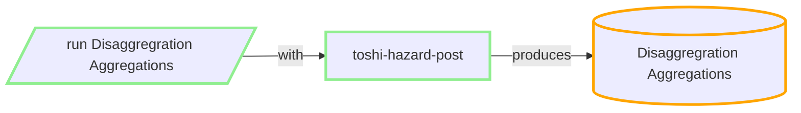

### Hazard Disaggregrations realizations

NSHM SRM LT has 49 parts (ref NSHM)

For each leaf of SRM logic tree, site, poE, IMT, VS30:

**Run a job with**

#### inputs:
 - inversion solution and distributed seismicity rate models (multiple) for the fault systems. i.e. one part of the Source LT)
 - which Hazard Model 
 - Needs Hazard Aggregregation to work out IMTL for requested PoE (352 bytes, via THS query) -> Hazard DB query 
 - gmms
 - GMM Logic Tree
 - site config: 1 site, poE
 - user config: 1 IMT, 1 VS30
 - disagg calc config

#### outputs:
  - one HDF5 file, size (TBA): 1 site, poE, IMT, VS30  => 680kB
  - CSV files: 80kB
  
#### resource/cost/metrics:

In general this job is v similar to hazard realizations, just much bigger. 

 - 49 * 680kB of realisations per site/VS30/IMT/PoE NSHM: (35,1,5,7) => 850mB 
 - Currently taking 1 - 4 m (* 1225) on AWS M5 instances 8 CPU.

 - Q: can we store this in DB? 
 - Q: how big will it become (multiply hazard realizations by 1000 for 7 PoEs)
 - Q: would optimisations to Hazard also benefit here?? Maybe not so much as the single site.

### Notion for possible improvement

If, when calcluating hazard curves, the disaggs could be stored as a byproduct. Some calculation , but main cost would is storage and extra I/O.

But:

  - hazard cals would need more granular IMTL grid. 

  - more IMTLS = more storage

 

-----

### Disaggregration Aggregations

#### inputs:
 - NSHM SRM logic tree that identifies the sources (Model, Source IDs) (from **nzshm-model** library)
 - realizations from prior step (e.g. 15GB of THS hazard curves )
 - identify the realisations (having the right permutations of site, IMTS, VS30s etc, using ToshiIDs). In spreadsheet now.
 - user can choose any subset of the rlz permutations.
 - config the aggregations (e.g. mean, cov, 0.1, 0.5...)

#### outputs:
 - entire LT structure in json (200kb)
 - caches composite realizatons to disk (many GB)
 - produces aggregate hazard curves in THS DynamoDB (4K site, 20 periods, 44 IMTS, => 280MB per VS30)

#### resource/cost/metrics:
 - runs locally or in AWS EC2 M5
 - for each VS30 (NSHM has 18) we run either:
    - locally (CDC 32 core machine): ~2m preproc + 15s per site/IMT => ~ 10 hours per VS30
    - cloud (up to ~600cores), ~30s per site/IMT => ~2 hours per VS30.
 - cloud scheduling within limits of Account DynamodDB rate limiting (reading rlzs).

 - Q: how to make it more resilient to AWS errors
 - Q: can we do it without DynamoDB/AWS

