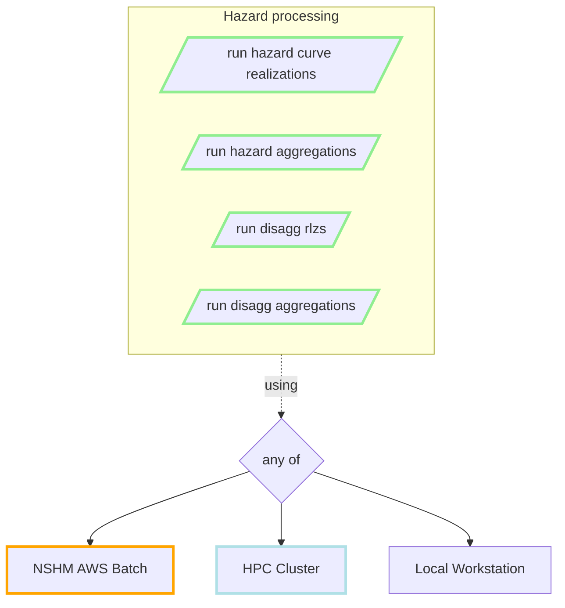
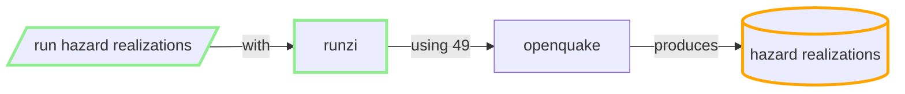
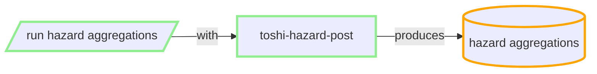

# CBC / CDC notes re processing improvements

CWG goals for 2024 NSHM phase:
 - Make NSHM processes more easily reproducible for 3rd parties
 - Make NSHM processes more efficient = less compute time to reach useful outputs

2nd supports the former, as one impediment to reproducability is the cost of setting up/running NSHM variants.

---- 
## Model review tools..

NSHM primary tools for analysis of Rupture Sets, Grand Inversions and Hazard are wrapped up in TUI, with some Kororaa features to be backwards ported.

 - Q: Can we make these tools useful to 3rd parties? 

### 3rd party review tools
 - Opensha reporting on Ruptsets or Inversions (The Solution Files [TSF]), and also hazard.
 - scecVdo 3D analysis on opensha solution files.

### NSHM review tools

 - TUI wraps uses opensha reporting, providing flip-chart like report view comparisons.

 - solvis libs provide analysis tool for TSF for python devs.

 - Kororaa and TUI web apps provide rupture maps tools based on solvis.

 - toshi-API (id and storage)

  Q: can we make the 'big services' optional for 3rd parties?

----
## Building new Inversions and Rupture Sets 

### Making Opensha more configurable...

i.e. Let users tweak the configs. 

So that users can override standard parts of NSHM with variations - e.g. additional paleo data. e.g

 - build new rupture sets: modify faults, modify connectivity
 - run new inversions: modify constraints, weights, etc

- Q: What is possible without Java development (for 3rd parties)? 

- Q: how to compare with NZSHM 22

 -Q: can we make NSHM hazard model comparisons easy

----
## Building custom hazard models

### Hazard processing flows

----
### NSHM Hazard realisations

NSHM SRM LT has 49 parts (ref NSHM)

For each leaf of the source rate model logic tree:

**Run a job with**

#### inputs:
 - inversion solution and distributed seismicity rate models (multiple) for the fault systems. i.e. one part of the Source LT)
 - gmms
 - GMM Logic Tree
 - site specifications config
 - user configs IMTS, etc
 - calculation configs

#### outputs:
  - one HDF5 file, size (TBA): NZSHM22 4k sites => 300 MB
  - CSV files: 200MB
  - optional export to DynamoDB =>  THH Hazard Realizations table
  - optional export to cache table => THH Hazard Realizations CACHE
  
#### resource/cost/metrics:
 
 - 49 * 300MB of realisations for NSHM model => 15GB
 - Currently ~24 hours for 4k sites, all NSHM periods. AWS M5 instance 8 CPU.

 - Q: for 3rd party, how many OQ jobs are needed? from 1-100.
 - Q: can anyone do it off-cloud? Yes it's just time.
 - Q: can CUDA be used here?
 - Q: what optimisations are possible (GEM)
 - Q: what else can be compared to openquake for this calcluation. opensha, [NSHMP](https://www.usgs.gov/software/nshmp-lib), bespoke? 

----

### Hazard Aggregrations

#### inputs:
 - NSHM SRM logic tree that identifies the sources (Model, Source IDs) (from **nzshm-model** library)
 - realizations from prior step (e.g. 15GB of THS hazard curves )
 - identify the realisations (having the right permutations of site, IMTS, VS30s etc, using ToshiIDs). In spreadsheet now.
 - user can choose any subset of the rlz permutations.
 - config the aggregations (e.g. mean, cov, 0.1, 0.5...)

#### outputs:
 - entire LT structure in json (200kb)
 - caches composite realizatons to disk (many GB)
 - produces aggregate hazard curves in THS DynamoDB (4K site, 20 periods, 44 IMTS, => 280MB per VS30)

#### resource/cost/metrics:
 - runs locally or in AWS EC2 M5
 - for each VS30 (NSHM has 18) we run either:
    - locally (CDC 32 core machine): ~2m preproc + 15s per site/IMT => ~ 10 hours per VS30
    - cloud (up to ~600cores), ~30s per site/IMT => ~2 hours per VS30.
 - cloud scheduling within limits of Account DynamodDB rate limiting (reading rlzs).

 - Q: how to make it more resilient to AWS errors
 - Q: can we do it without DynamoDB/AWS

