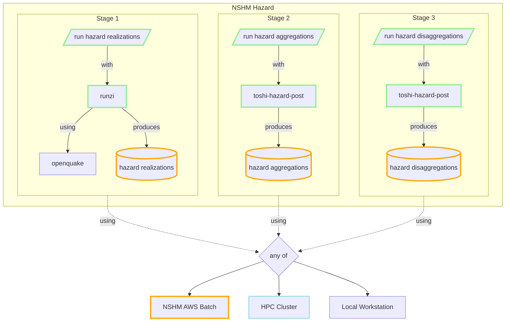

# NSHM Hazard processing flow


## NSHM AWS services for Hazard

```
mermaid
graph TD
    classDef nshm stroke:lightgreen, stroke-width:3px
    classDef AWS stroke:orange, stroke-width:3px
    classDef SVC stroke:powderblue, stroke-width:3px
        
    batch[[Batch]]:::AWS
    EC2:::AWS    
    Fargate:::AWS    

    dynamoDB[(DynamoDB)]:::AWS
    s3[("Simple Storage S3")]:::AWS
    ENV{any of}
    batch --> ENV
    batch --> Fargate

```

```
mermaid
graph LR
    classDef nshm stroke:lightgreen, stroke-width:3px
    classDef AWS stroke:orange, stroke-width:3px
    classDef SVC stroke:powderblue, stroke-width:3px

    subgraph AWSENV[NSHM AWS environment]
        ths[toshi-hazard-store]:::nshm
        thp[toshi-hazard-post]:::nshm
        
        tapi[toshi-api]:::nshm

        oq[openquake]
        thp -.->ths
        thp -.-> AWS
        thp -.-> tapi
        R -.-> tapi
        
        %% R -.-> thp
        R-.->|runs| thp -.->|on| AWS
        R-.->|runs| oq -.->|on| AWS
        
        ths -.-> AWS

    end  
```