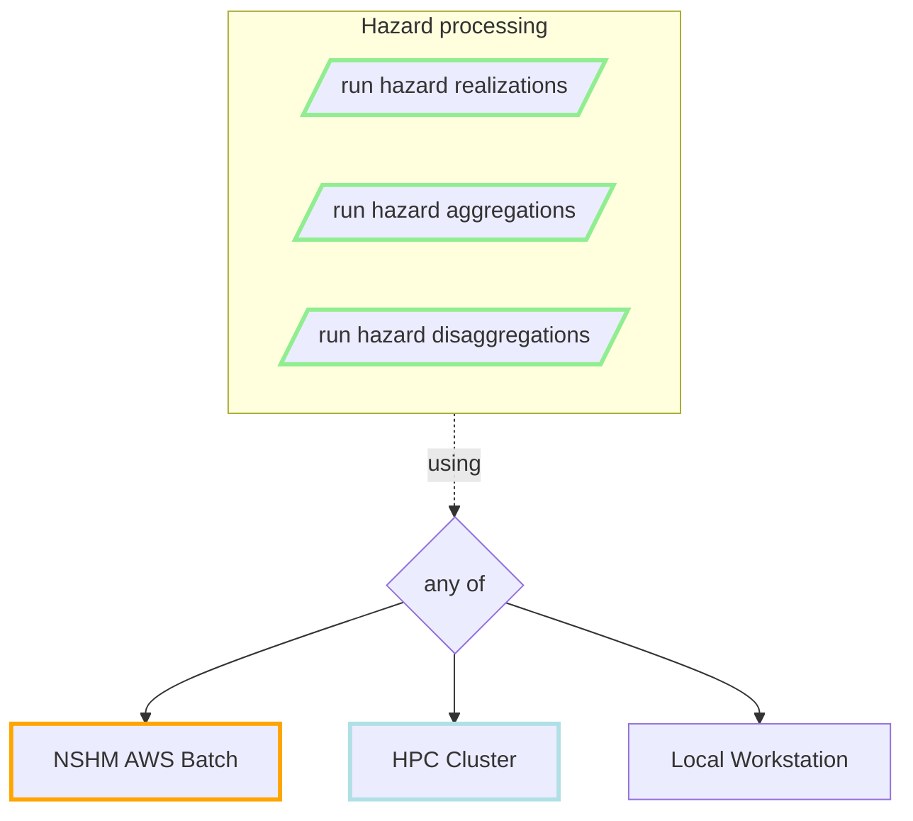
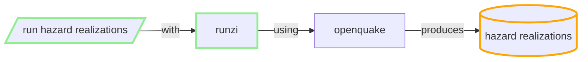
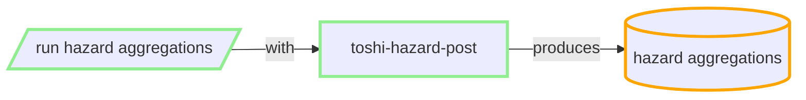
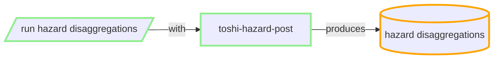
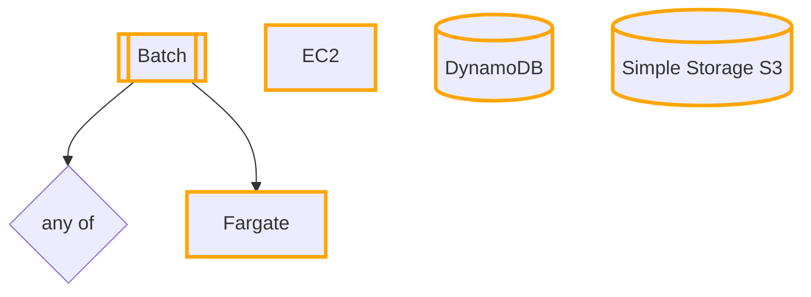
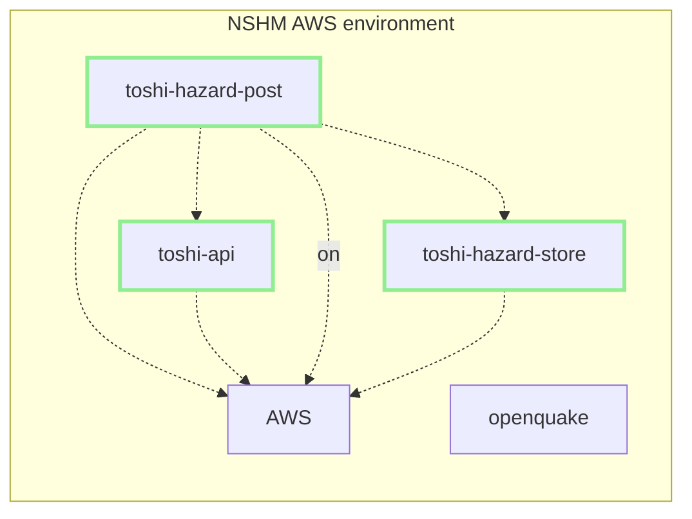

# Hazard processing flows

TODO: describe the boxes

## Hazard Realizations

TODO: describe the boxes

## Hazard Aggregrations

TODO: describe the boxes

## Hazard Disaggregrations

TODO: describe the boxes

## NSHM Hazard infrastructure WIP

TODO ... 

