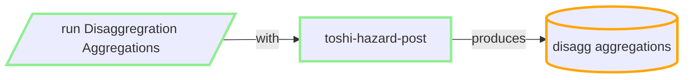

## Produce Disaggregration Aggregations

```mermaid
flowchart LR
    classDef nshm stroke:lightgreen, stroke-width:3px
    classDef AWS stroke:orange, stroke-width:3px

    RHD[/run Disaggregration Aggregations/]:::nshm
    thp[toshi-hazard-post]:::nshm
    DA[(disagg aggregations)]:::AWS

    RHD -->|with| thp -->|produces| DA
```

### inputs:

### outputs:

### resource/cost/metrics:

