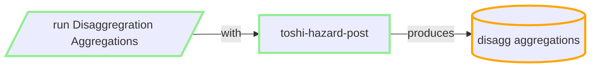

## Produce Disaggregration Aggregations

### inputs:
 - NSHM SRM logic tree that identifies the sources (Model, Source IDs) (from **nzshm-model** library)
 - realizations from prior step (e.g. 15GB of THS hazard curves )
 - identify the realisations (having the right permutations of site, IMTS, VS30s etc, using ToshiIDs). In spreadsheet now.
 - user can choose any subset of the rlz permutations.
 - config the aggregations (e.g. mean, cov, 0.1, 0.5...)

### outputs:
 - entire LT structure in json (200kb)
 - caches composite realizatons to disk (many GB)
 - produces aggregate hazard curves in THS DynamoDB (4K site, 20 periods, 44 IMTS, => 280MB per VS30)

### resource/cost/metrics:
 - runs locally or in AWS EC2 M5
 - for each VS30 (NSHM has 18) we run either:
    - locally (CDC 32 core machine): ~2m preproc + 15s per site/IMT => ~ 10 hours per VS30
    - cloud (up to ~600cores), ~30s per site/IMT => ~2 hours per VS30.
 - cloud scheduling within limits of Account DynamodDB rate limiting (reading rlzs).

