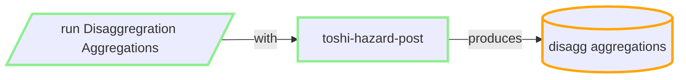

## Produce Disaggregration Aggregations

### inputs:
  
  - JSON index of disagg realisations produced in prior
  
  - realizations from prior step CSV

  - user configuration for the aggregations

### outputs:
 -  produces aggregate disagg curves in **THS DynamoDB** per site, imt, vs30, poE there is approx 100 times more than equiv hazard.

    approx 40kB per site, imt, vs30, poE, so for 36 sites, 5 periods, 7 PoEs => 50mB

 ### resource/cost/metrics:

 - runs locally or in AWS EC2 M5

 - for each VS30 (NSHM has 18) we run either:
    
    - locally (CDC 32 core machine): ~2m preproc + 1500s per permutation/core => ~ 15 hours per VS30

    - cloud (up to ~600cores) => ~2 hours per VS30.

 - cloud scheduling within limits of Account DynamodDB rate limiting (reading rlzs).

