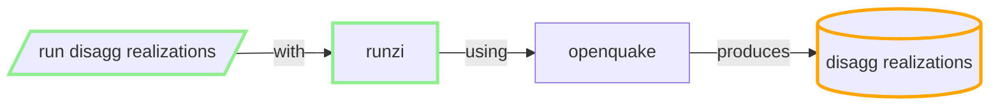

## Produce Disaggregration realizations

NSHM SRM LT has 49 parts (ref NSHM)

For each component branch of the SRM logic tree, site, poE, IMT, VS30:

**Run a job with**

### inputs:
 - inversion solution and distributed seismicity rate models (multiple) for the fault systems. i.e. one part of the Source LT)
 - which Hazard Model 
 - Needs Hazard Aggregregation to work out IMTL for requested PoE (352 bytes, via THS query) -> Hazard DB query 
 - GMCM Logic Tree
 - site config: 1 site, poE
 - user config: 1 IMT, 1 VS30
 - disagg calc config

### outputs:
  - one HDF5 file, size (TBA): 1 site, poE, IMT, VS30  => 680kB
  - CSV files: 80kB
  - JSON index of disagg realisations produced
  
### resource/cost/metrics:

In general this job is v similar to hazard realizations, just much bigger. 

 - 49 * 680kB of realisations per site/VS30/IMT/PoE NSHM: (35,1,5,7) => 850mB

 - Currently taking 1 - 4 m (* 1225) on AWS M5 instances 8 CPU.

