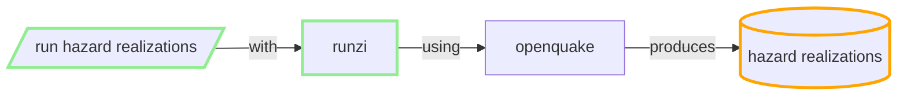

## Produce Hazard realisations

NSHM Seismicity Rate Model Logic Tree (SRM LT) has 49 parts (ref NSHM)

For each component branch of the source rate model logic tree:

**Run a job with**

### inputs:
 - inversion solution and distributed seismicity rate models (multiple) for the fault systems (i.e. one part of the SRM LT).
 - GMCM Logic Tree
 - site specifications config
 - user configs IMTS, etc
 - calculation configs

### outputs:
  - one HDF5 file, size (TBA): NZSHM22 4k sites => 300 MB
  - CSV files: 200MB
  - optional export to DynamoDB =>  THH Hazard Realizations table
  - optional export to cache table => THH Hazard Realizations CACHE
  
### resource/cost/metrics:
 
 - 49 * 300MB of realisations for NSHM model => 15GB
 - Currently ~24 hours for 4k sites, all NSHM periods. For the largest component branch of the SRM LT (typically crustal sources). AWS M5 instance 8 CPU.

