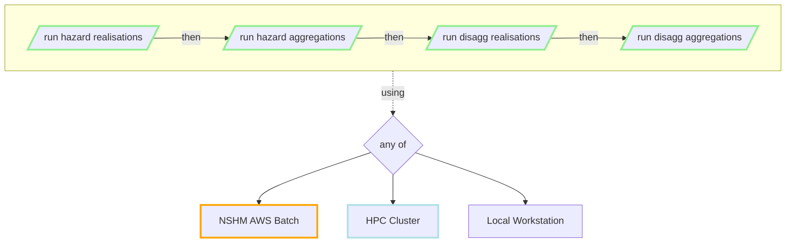

# NSHM Hazard processing

NSHM Hazard processing has four main processes, which each depend on each other in the following sequence:

 - [Produce Hazard Realisations](./hazard_realisations.md)

 - [Produce Hazard Aggregrations](./hazard_aggregations.md)

 - [Produce Disagg Realisations](./disagg_realisations.md)

 - [Produce Disagg Aggregations](./disagg_aggregations.md)

Each process may be run on several compute environments:

 - an [NSHM AWS Batch]() cloud compute environment

 - an [HPC cluster]() compute environment[^1]

 - a [Local Workstation]() eg 16-32 cores, 128 GB RAM, 1TB available disk.

[^1]: HPC environment support is currenltly limited, but is on the CWG work program.

!!! info

    The full NZSHM model, with around 4000 hazard sites, will currently take months to process unless multiple jobs can be run concurrently. Details of the approximate resource and time requirements can be found in each process description above.

    The NZSHM team are working with other hazard software developers to explore ways to reduce the necessary computational costs.
