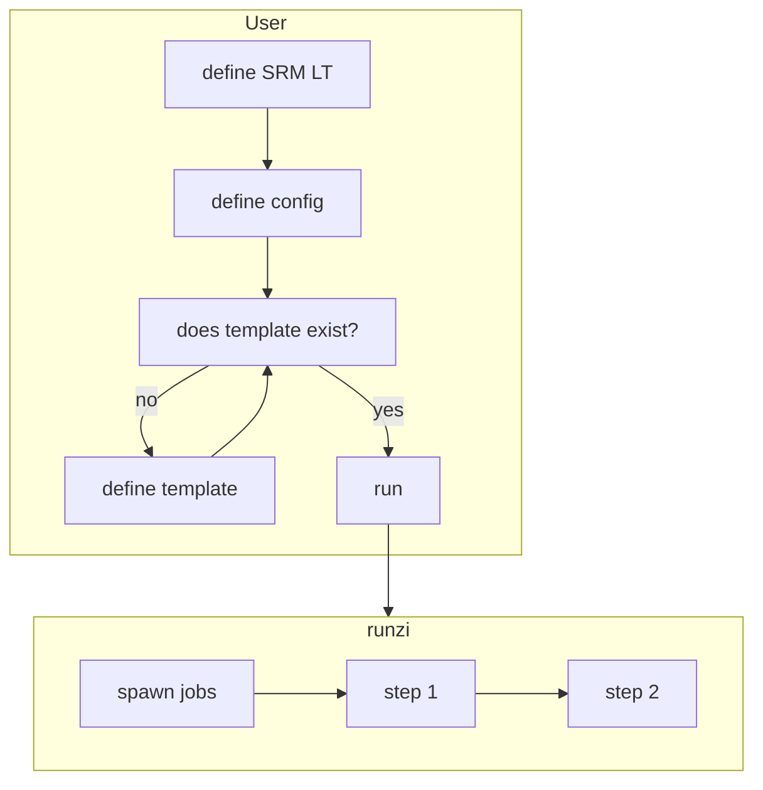

```mermaid
flowchart TD
    classDef lane stroke:orange, stroke-width:3px
    classDef process stroke:powderblue, stroke-width:3px
    classDef choice stroke:black, stroke-width:3px

    subgraph User["User"]
        direction LR
        SLT[define SRM LT]
        config[define config]
        template[does template exist?]
        def_template[define template]
        run[run]
    end
    SLT --> config --> template
    template -->|no| def_template
    def_template --> template
    template -->|yes| run

    subgraph runzi["runzi"]
        direction LR
        spawn_jobs[spawn jobs]
        s1[step 1]
        s2[step 2]
    end
    spawn_jobs --> s1 --> s2

    %% links
    run --> runzi


```