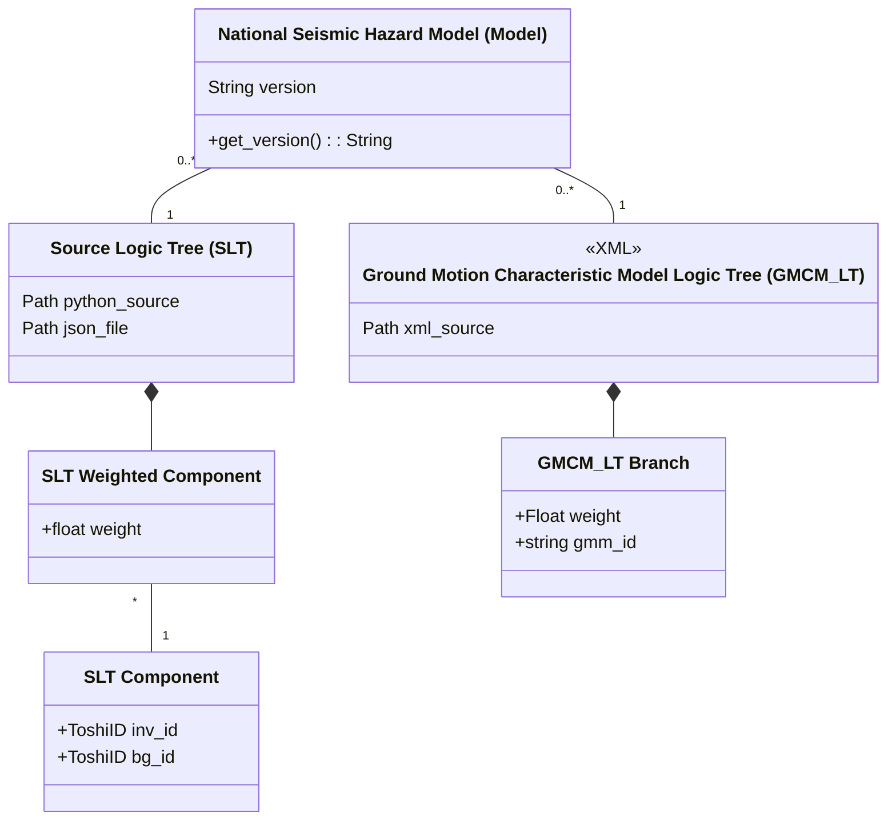
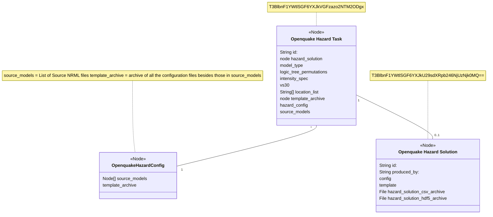
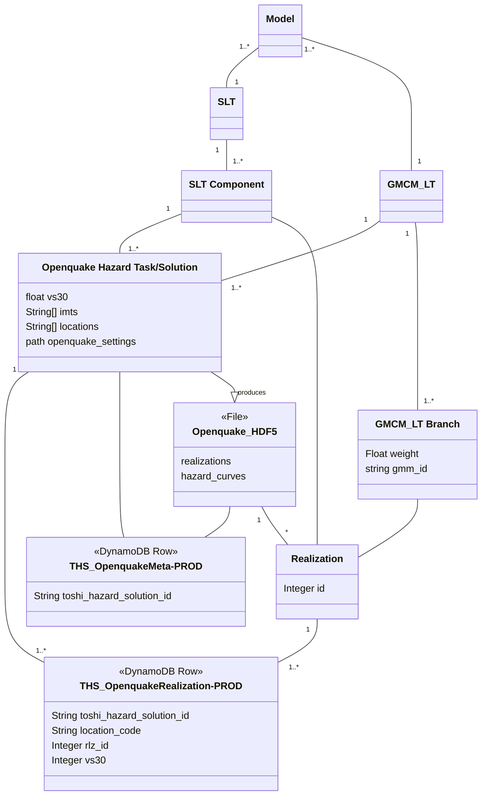

# NZSHM-Model relationships

## nzshm-model etc



## Toshi Hazard objects (Task + Solution + Config)

[see here](./toshi_schema)



## OQ hazard processing



## Not needed

```
    class SLTC_VL["SLTC_VS30_Location"] {
        +Int vs30
        +String location_code
    }

```