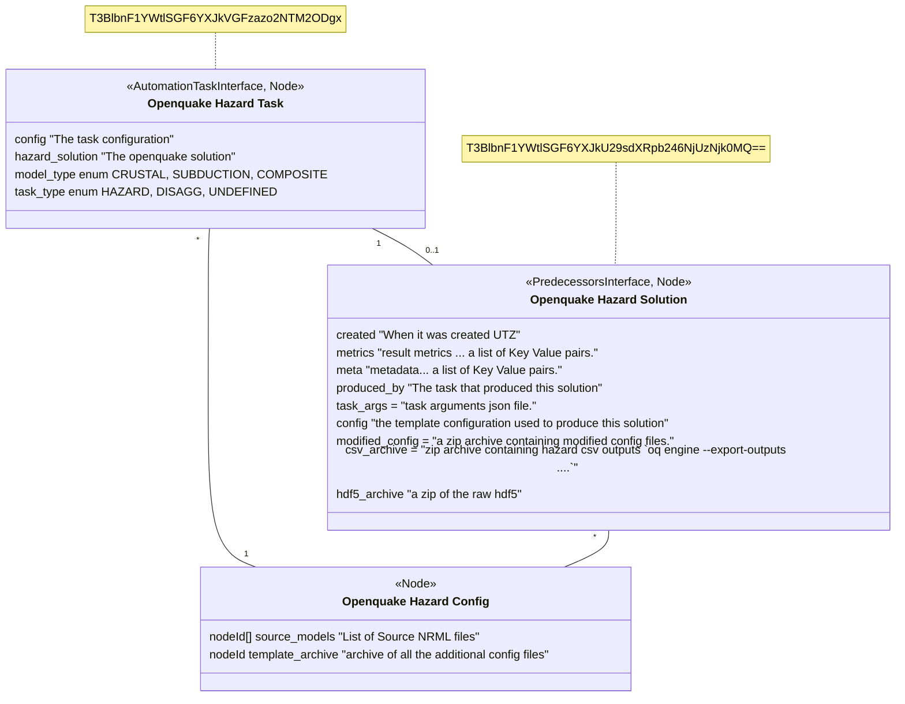

## Toshi Hazard objects (Task + Solution + Config)


### crumbs
```
    class OHT1["Openquake Hazard Task from pres"] {
        <<Node>>
        String id: 
        node hazard_solution
        model_type
        logic_tree_permutations
        intensity_spec
        vs30
        String[] location_list
        node template_archive
        hazard_config
        source_models
    }
```